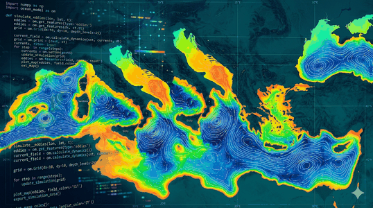

# GeDa — Gestió de Dades: Comunicacions, Programació i Simulació

---

**Course**: GeDa - Gestió de Dades: Comunicacions, Programació i Simulació  
**Program**: Ciències i Tecnologies del Mar (CiTM)  
**University**: Universitat Politècnica de Catalunya (UPC)  
**Author**: Enoc Martínez  
**Department**: Departament d'Enginyeria Electrònica (EEL)  
**Contact**: enoc.martinez@upc.edu  

  

---

## About the course

GeDa introduces programming and data management applied to the marine domain. The course is divided into **6 theory sessions** (full group) and **4 laboratory sessions** (split group).

Across the course you will work with:

- **Programming fundamentals** — variables and types, lists and dictionaries, flow control, functions, and reading and writing files, all in Python 3.
- **Marine data structures** — structured, semi-structured and unstructured data; CSV, JSON and NetCDF.
- **Data analysis and visualisation** — pandas DataFrames, and building figures that actually communicate something.
- **APIs and automation** — client–server architecture, HTTP, and scripts that fetch and report data without you.
- **Repositories and quality control** — Copernicus Marine, EMODnet, ERDDAP, and QARTOD flagging of real time series.
- **Machine learning** — supervised and unsupervised learning applied to oceanographic data.

## Laboratory sessions

| Lab | Topic | Depends on |
|---|---|---|
| [LAB1](LAB1/) | Python 3 basics — types, flow control, functions, files | T01, T02 |
| LAB2 | CSV files, pandas and matplotlib | T03 |
| LAB3 | Automation and APIs using Telegram bots | T04 |
| LAB4 | Working with Copernicus data — automated download, geographic plots | T05 |

Open a lab folder, read its `README.md`, and work through the tasks in order. Exercises are designed to be completed in Python 3 — no prior programming experience is assumed.

## License

Released under the MIT License. See [LICENSE](LICENSE).
